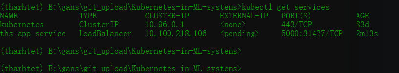

## Basic-Kubernetes-in-ML-systems

#### How run the application
##### build image first
```shell
docker build . -t "gpu"
```

##### please update deployment.ymal
local : imagePullPolicy: Never
cloud : imagePullPolicy: IfNotPresent


#### How locally run the application

##### start minikube
```shell
minikube start
```

##### Apply deployment and check
```bash
kubectl apply -f basic\deployment.ymal --validate=false
kubectl get deployments
```


##### Apply Service and check
```bash
kubectl apply -f basic\service.ymal --validate=false

kubectl get services
```




